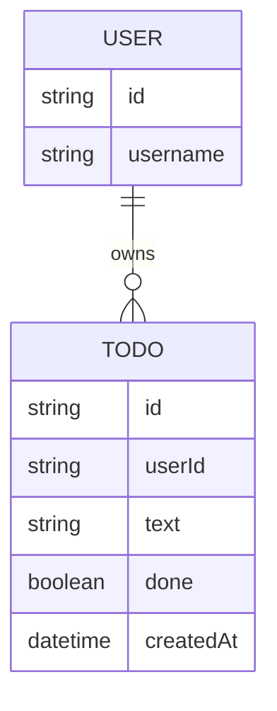

# Domain Model

The model is small: each signed-in user owns a private list of todos. A todo carries only its text and a done/not-done status.

- `USER` is not stored by this system — it is the identity Thunder asserts on every request (`userId` is the caller's subject).
- `TODO.userId` scopes every row to its owner; no todo is ever visible or reachable by another user.
- `TODO.done` starts `false` and can only be flipped to `true` — there is no edit or delete path.

