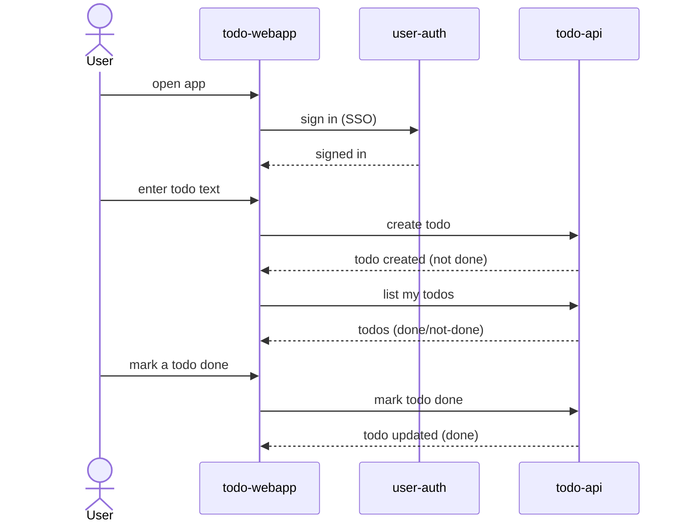

# Sign in and manage todos

A signed-in User creates todos and marks them done, with every request carried by their Thunder session.

```mermaid
sequenceDiagram
    actor User
    participant todo-webapp
    participant user-auth
    participant todo-api

    User->>todo-webapp: open app
    todo-webapp->>user-auth: sign in (SSO)
    user-auth-->>todo-webapp: signed in
    User->>todo-webapp: enter todo text
    todo-webapp->>todo-api: create todo
    todo-api-->>todo-webapp: todo created (not done)
    todo-webapp->>todo-api: list my todos
    todo-api-->>todo-webapp: todos (done/not-done)
    User->>todo-webapp: mark a todo done
    todo-webapp->>todo-api: mark todo done
    todo-api-->>todo-webapp: todo updated (done)
```

